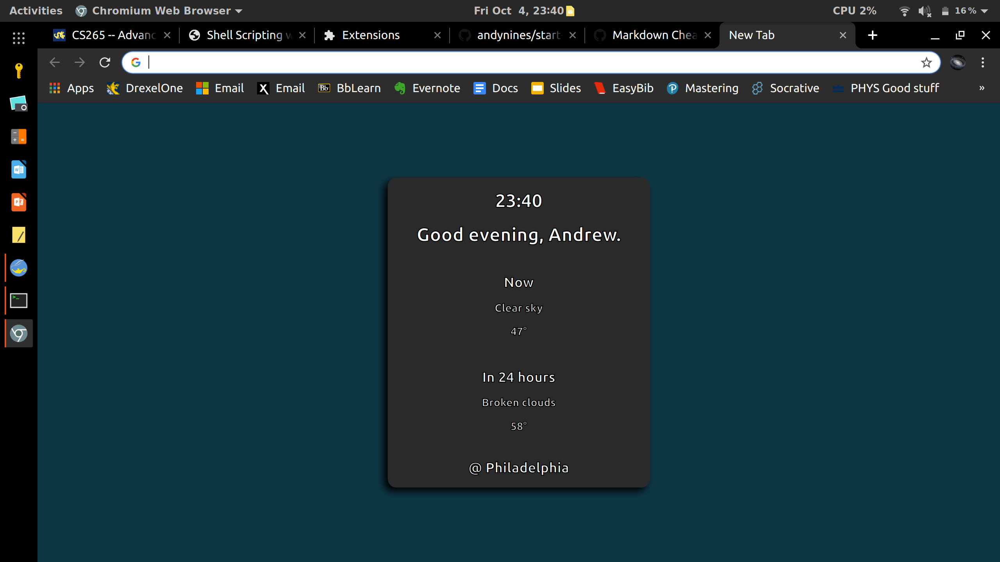

# My Start Page
I would never go out of the way to check the weather, so I made it appear right on a home page that looks simple and loads fast. Weather data is retrieved from OpenWeatherMap's 5-day forecast API.
## License
MIT - See `license.txt` for details.
## Screenshot

## Use
This extension features a built-in options page that allows you to configure it with your name, location, and API key. You can load the extension into Chrome as an unpacked extension.
